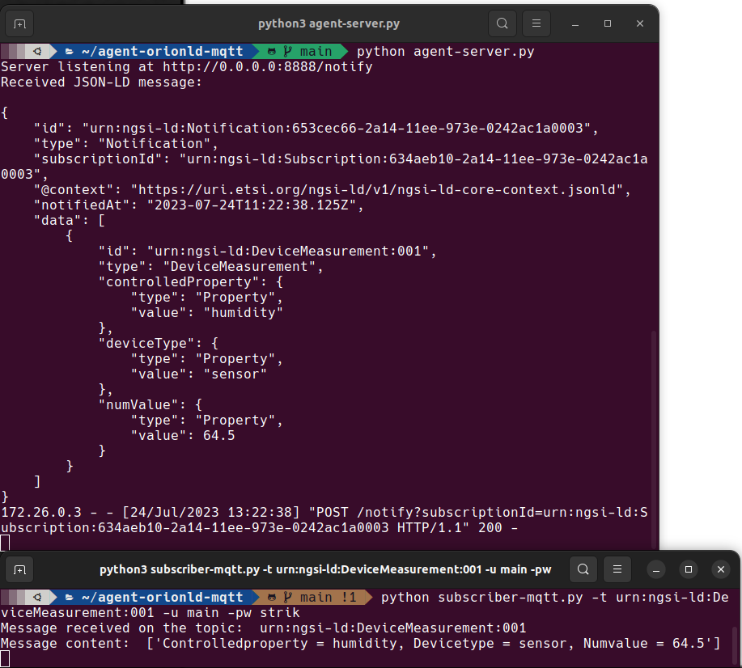

# 📦  agent-orionld-mqtt
## Description: Intermediate agent between an Orion-LD context broker and MQTT

This project is based on creating an agent that connects an Orion-LD broker with MQTT, with real-time translation between them, allowing a very visual and straightforward view of the status of all sensors and measuring devices. In addition, `subscriber-mqtt.py` takes care of connecting subscribers to the different topics created automatically by the agent to be able to monitor the status of the devices.

## Scheme


## How-To-Use

To fully deploy the dockerized scheme, the first step is to launch the `docker-compose.yaml` files for both Orion-LD and Eclipse Mosquitto (MQTT). To do this, we will use docker-compose and execute the following command: `docker-compose up`.

Once we have both Orion-LD and MQTT deployed, the next step is to launch the Python agent that acts as a translator for Orion-LD notifications to MQTT. To do this, the first thing is to make a CURL request using the correct specifications of the ETSI NGSI-LD API to subscribe to the desired devices.

Once the subscription is active, and after specifying the endpoint with the IP where the Python agent is listening on port 8888, we can correctly receive the notifications.

## Example of CURL for subscriptions

As an example, we will use a Curl command that subscribes to all devices of the type "DeviceMeasurement"

```

curl -X POST \
  http://example.com:1026/ngsi-ld/v1/subscriptions \
  --header 'Content-Type: application/ld+json' \
  --data-raw '{
    "@context": "https://uri.etsi.org/ngsi-ld/v1/ngsi-ld-core-context.jsonld",
    "description": "Subscription for changes in devices of type DeviceMeasurement",
    "type": "Subscription",
    "entities": [
      {
        "type": "DeviceMeasurement"
      }
    ],
    "watchedAttributes": ["controlledProperty", "deviceType", "numValue"],
    "q": "numValue>0",
    "notification": {
      "attributes": ["controlledProperty", "deviceType", "numValue"],
      "format": "normalized",
      "endpoint": {
        "uri": "http://IP-Address:8888/notify",
        "accept": "application/ld+json"
      }
    }
  }'


```

## Syntax for subscriber-mqtt.py

```
usage: subscriber-mqtt.py [-h] -t TOPIC -u USER -pw PASSWORD

Script to subscribe to an MQTT topic

options:
  -h, --help            show this help message and exit
  -t TOPIC, --topic TOPIC
                        MQTT topic name (Device URN), example: urn:ngsi-
                        ld:Device:001
  -u USER, --user USER  User to access the MQTT broker, example: user1
  -pw PASSWORD, --password PASSWORD
                        Password to access the MQTT broker, example: 1234

```


This Curl command creates a new subscription to monitor changes in devices of type "DeviceMeasurement". The notification will be sent to the provided endpoint "http://IP-Address:8888/notify" in JSON-LD format, and it will include the specified attributes: "controlledProperty", "deviceType", and "numValue".



In the image, you can observe the agent receiving the notification with the message body in JSON-LD format. It is responsible for publishing the topic with the device's name (in this case, the device's URN is used) and all its information updated with each change it receives.

The lower terminal is the application `subscriber-mqtt.py` for the clients where they can see in real-time the changes perceived by the different devices in a much more user-friendly and straightforward format.

Author: [Pedro José Gabaldón Penalva](https://github.com/CodeStrik/)

Repository: [agent-orionld-mqtt](https://github.com/CodeStrik/agent-orionld-mqtt/tree/main)