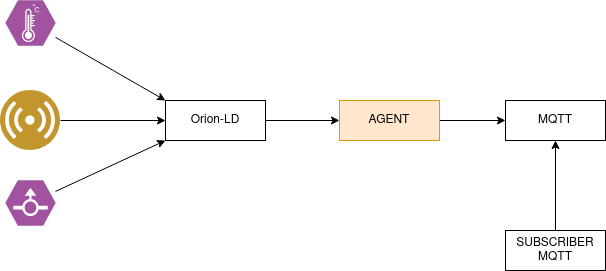
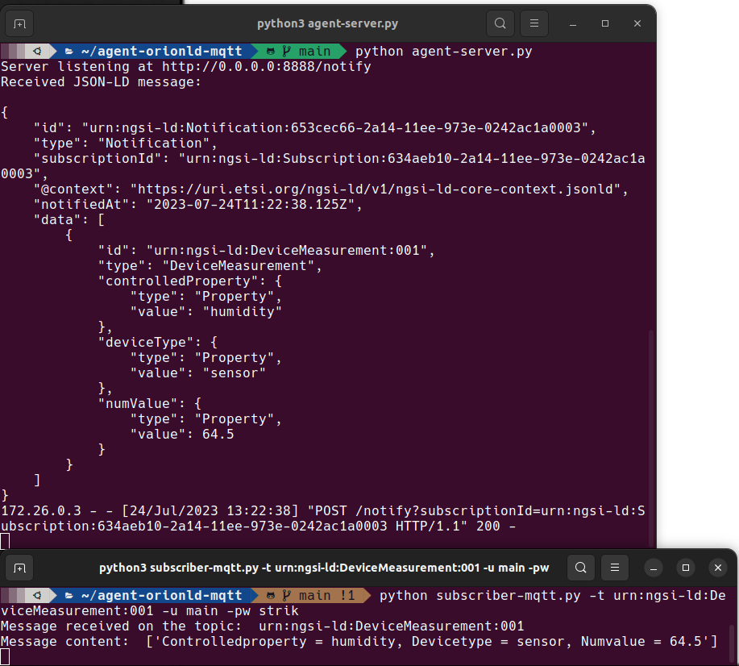

# 📦  agent-orionld-mqtt
## Descripción: Agente intermedio entre un broker de contexto Orion-LD y MQTT.

Este proyecto se basa en crear un agente que conecte un broker Orion-LD con MQTT, con traducción en tiempo real entre ambos, permitiendo una visualización directa del estado de todos los sensores y dispositivos de medición. Además, `subscriber-mqtt.py` es un cliente desarrollado para facilitar la visualización de los datos, gracias a este cliente se puede realizar una suscripción a un dispositivo en el servidor MQTT de manera muy sencilla.

## Esquema




## Como usarlo

Para implementar completamente el esquema dockerizado, el primer paso es ejecutar los archivos `docker-compose.yaml` tanto para Orion-LD como para Eclipse Mosquitto (MQTT). Para hacerlo, utilizaremos docker-compose y ejecutaremos el siguiente comando: `docker-compose up` para cada uno.

Una vez que tengamos tanto Orion-LD como MQTT desplegados, el siguiente paso es lanzar el agente Python que actúa como traductor de notificaciones de Orion-LD a MQTT. Para ello, lo primero es hacer una solicitud CURL utilizando las especificaciones correctas de la API ETSI NGSI-LD para suscribirse a los dispositivos deseados.

Una vez que la suscripción esté activa y después de especificar el punto final (endpoint) con la dirección IP donde el agente Python está escuchando en el puerto 8888, podremos recibir correctamente las notificaciones.

## Ejemplo de mensaje CURL para las suscripciones

Como ejemplo, utilizaremos un comando CURL que se suscribe a todos los dispositivos del tipo "DeviceMeasurement"

```

curl -X POST \
  http://example.com:1026/ngsi-ld/v1/subscriptions \
  --header 'Content-Type: application/ld+json' \
  --data-raw '{
    "@context": "https://uri.etsi.org/ngsi-ld/v1/ngsi-ld-core-context.jsonld",
    "description": "Subscription for changes in devices of type DeviceMeasurement",
    "type": "Subscription",
    "entities": [
      {
        "type": "DeviceMeasurement"
      }
    ],
    "watchedAttributes": ["controlledProperty", "deviceType", "numValue"],
    "q": "numValue>0",
    "notification": {
      "attributes": ["controlledProperty", "deviceType", "numValue"],
      "format": "normalized",
      "endpoint": {
        "uri": "http://IP-Address:8888/notify",
        "accept": "application/ld+json"
      }
    }
  }'


```

## Uso de subscriber-mqtt.py

```
usage: subscriber-mqtt.py [-h] -t TOPIC -u USER -pw PASSWORD

Script to subscribe to an MQTT topic

options:
  -h, --help            show this help message and exit
  -t TOPIC, --topic TOPIC
                        MQTT topic name (Device URN), example: urn:ngsi-
                        ld:Device:001
  -u USER, --user USER  User to access the MQTT broker, example: user1
  -pw PASSWORD, --password PASSWORD
                        Password to access the MQTT broker, example: 1234

```


Este comando CURL crea una nueva suscripción para monitorear cambios en dispositivos del tipo "DeviceMeasurement". Las notificaciones serán enviadas al punto final proporcionado "http://IP-Address:8888/notify" en formato JSON-LD, e incluirán los atributos especificados: "controlledProperty", "deviceType" y "numValue".



En la imagen, se puede observar al agente recibiendo la notificación con el cuerpo del mensaje en formato JSON-LD. Es responsable de publicar en el servidor MQTT el topic con el nombre del dispositivo (en este caso, se utiliza la URN del dispositivo) y toda su información actualizada con cada cambio que recibe.

El terminal inferior corresponde a la aplicación `subscriber-mqtt.py` para los clientes, donde pueden ver en tiempo real los cambios percibidos por los diferentes dispositivos en un formato mucho más amigable y sencillo de entender.

Author: [Pedro José Gabaldón Penalva](https://github.com/CodeStrik/)

Repository: [agent-orionld-mqtt](https://github.com/CodeStrik/agent-orionld-mqtt/tree/main)
